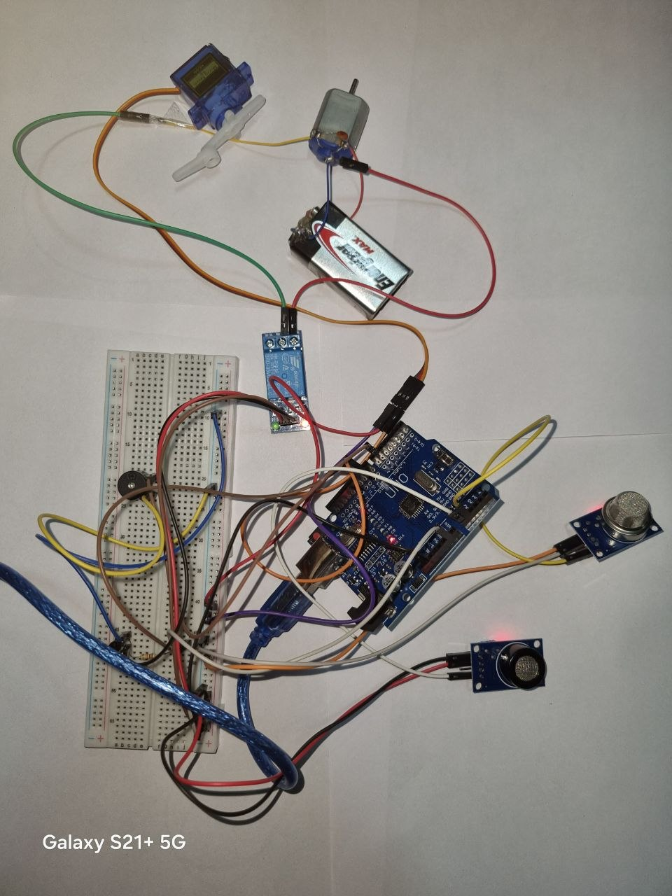

# 🛡️ Smart Safety Monitor

An AI-powered real-time safety monitoring system that detects **gas leaks** combined with **driver unconsciousness** (eye closure) and triggers emergency responses automatically.

> Built with Python, OpenCV, MediaPipe, and Arduino UNO.

---

## 📸 Demo



---

## 🎯 How It Works

The system monitors two conditions simultaneously:

| Condition | Sensor | Action |
|-----------|--------|--------|
| Gas leak detected | MQ-7 (CO) / MQ-6 (LPG) | Warning alert |
| Eyes closed (unconscious) | Webcam + MediaPipe AI | Warning alert |
| **Both together** | Combined | 🚨 Full emergency: buzzer + fan + servo + Telegram |

---

## 🔧 Hardware Components

| Component | Purpose |
|-----------|---------|
| Arduino UNO | Main controller |
| MQ-7 Sensor | Carbon monoxide (CO) detection |
| MQ-6 Sensor | LPG / gas detection |
| Buzzer | Audio alert |
| Servo Motor | Visual alert (physical indicator) |
| Relay Module | Controls DC fan |
| DC Motor + Fan | Ventilation on emergency |
| Webcam | Face / eye monitoring |

---

## 🖥️ Software Stack

- **Python 3.8+**
- **OpenCV** — Camera feed processing
- **MediaPipe** — AI face landmark detection (Eye Aspect Ratio)
- **PySerial** — Arduino communication
- **Telegram Bot API** — Remote emergency alerts

---

## ⚡ Quick Start

### 1. Clone the repository
```bash
git clone https://github.com/YOUR_USERNAME/smart-safety-monitor.git
cd smart-safety-monitor
```

### 2. Install dependencies
```bash
pip install -r requirements.txt
```

### 3. Configure environment variables
```bash
cp .env.example .env
```
Edit `.env` and add your values:
```
BOT_TOKEN=your_telegram_bot_token
CHAT_ID=your_telegram_chat_id
ARDUINO_PORT=COM5
GAS_THRESHOLD=300
```

### 4. Upload Arduino code
Open `ARDUINO_CODE.ino` in Arduino IDE and upload to your Arduino UNO.

### 5. Run the system
```bash
python without_esp.py
```

Press **Q** to quit.

---

## 📁 Project Structure

```
smart-safety-monitor/
│
├── without_esp.py       # Main Python application
├── ARDUINO_CODE.ino     # Arduino firmware
├── requirements.txt     # Python dependencies
├── .env.example         # Environment variables template
├── .gitignore           # Git ignore rules
└── README.md            # This file
```

---

## 🔌 Wiring Diagram

| Arduino Pin | Component |
|-------------|-----------|
| A0 | MQ-7 (AOUT) |
| A1 | MQ-6 (AOUT) |
| Pin 6 | Buzzer (+) |
| Pin 9 | Servo (Signal) |
| Pin 10 | Relay (IN) |
| 5V / GND | All sensors |

---

## 🚀 Future Improvements

- [ ] Eye closure timer (alert only after 2+ seconds closed)
- [ ] Real-time gas level graph
- [ ] Event logging to CSV
- [ ] Web dashboard
- [ ] Multi-camera support

---

## 👨‍💻 Authors

**Bilsan Amjad Anwar Al-Shabboul**  
**Sham Mohammad Nabil Al-Maqri**  
Team ELITE — Jadara University, Jordan  
📧 bilsan09216@gmail.com  
🔗 [LinkedIn](https://www.linkedin.com/in/bilsan-alshboul-89164b328)  
🏆 RoboCraft Competition — IEEE RAS Student Chapter, Jadara University
💻 [GitHub](https://github.com/Bilsan0)

---

## 📄 License

MIT License — feel free to use and build upon this project.
